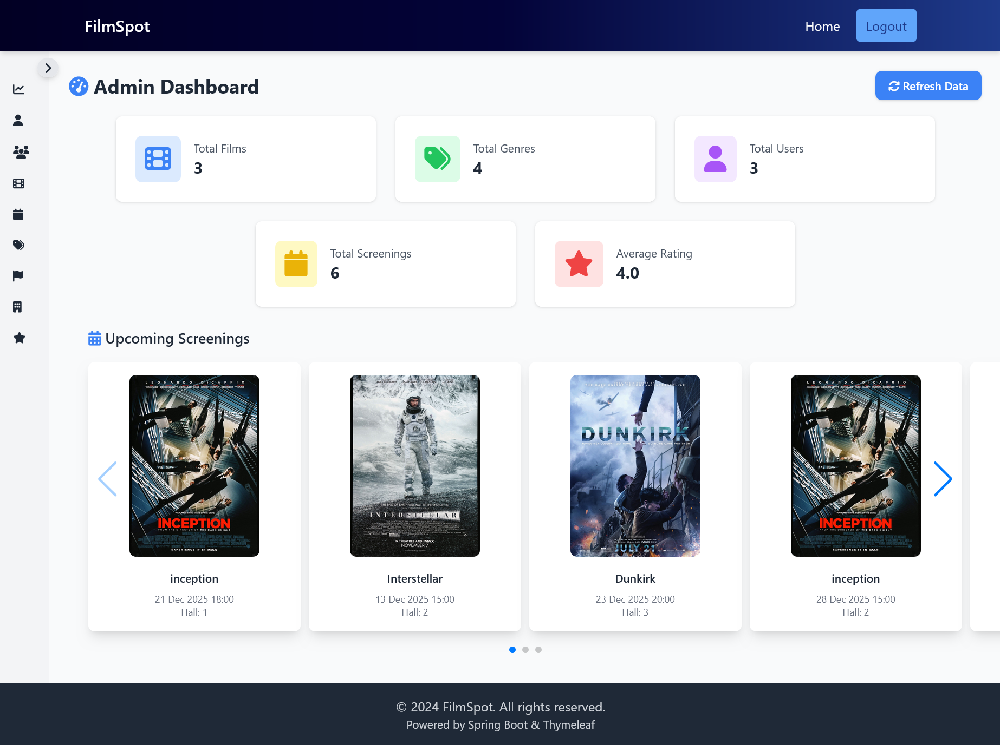
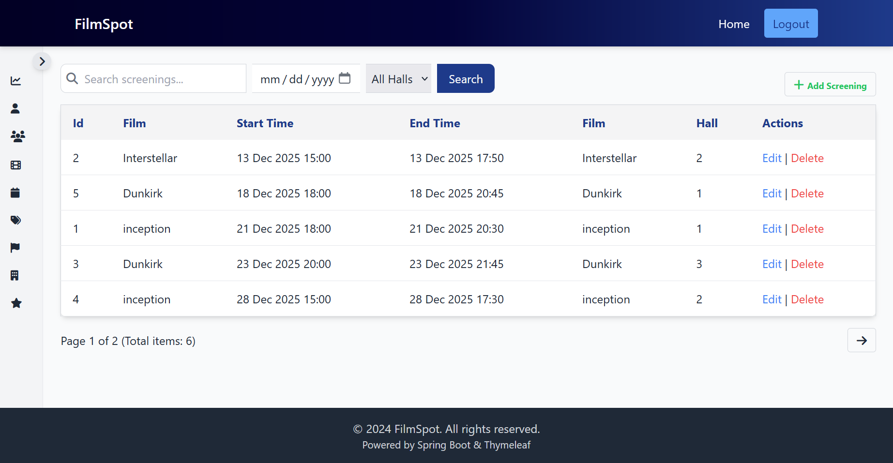
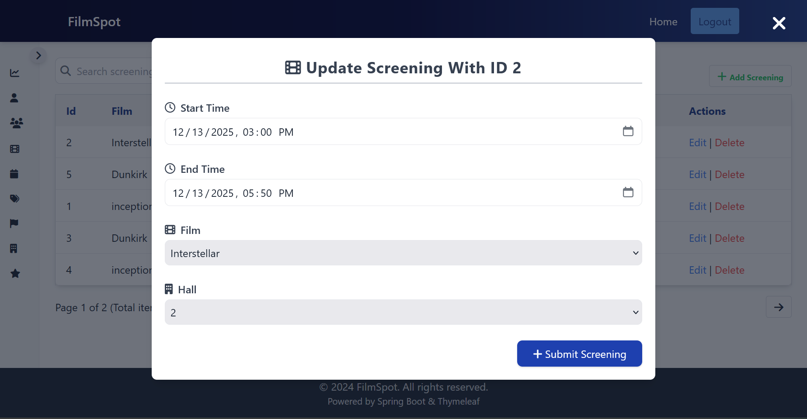
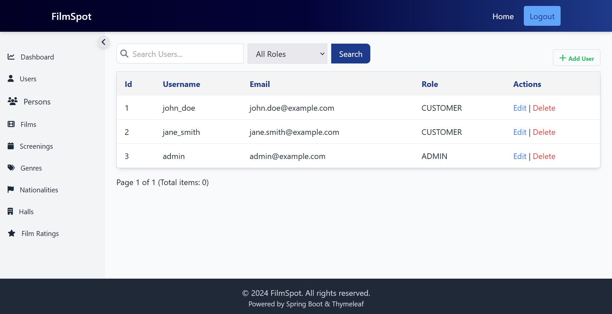
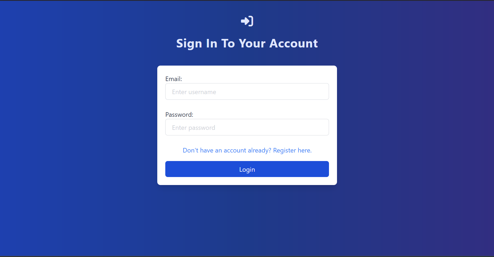
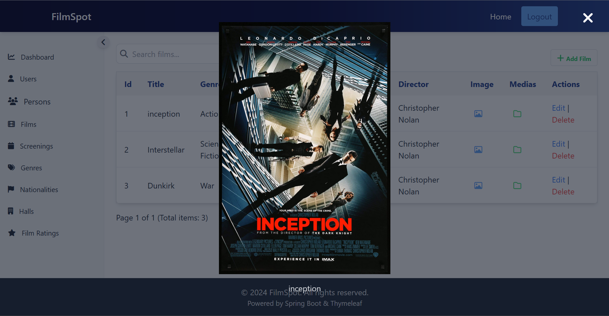

# Films Spring Boot Project

This project is a Spring Boot-based backend application that supports two main areas: **Customer** and **Admin**. It provides a backend for managing film-related data and serves as the API for an Angular frontend application.

---

## Features

### Admin Area

The admin area is built using **Thymeleaf templates**, **HTMX**, and **Tailwind CSS**. It provides an intuitive interface for managing the application's data. Key features include:

1. **Dashboard**  
   A central hub for administrators to view key metrics and manage the system.  
   

2. **Manage Screenings**

    - List all screenings in the system.  
      
    - Edit screening details.  
      

3. **Manage Users**

    - View and manage user accounts.  
      

4. **Authentication**

    - Secure login for administrators.  
      

5. **View Movie Covers**
    - Preview movie covers directly in the admin interface.  
      

---

### API for Angular App

The backend also provides a RESTful API that is consumed by an Angular frontend application. This API allows customers to interact with the system, including:

-   Viewing available movies and upcoming screenings.
-   Rating Movies

The Angular frontend for this project can be found in the following repository:  
[https://github.com/Kaouthar15/Films_Angular](https://github.com/Kaouthar15/Films_Angular)

---

## Technologies Used

-   **Spring Boot**: Backend framework.
-   **Thymeleaf**: Server-side rendering for the admin area.
-   **HTMX**: For dynamic, interactive web pages.
-   **Tailwind CSS**: For styling the admin interface.
-   **Spring Data JPA**: For database interactions.
-   **Spring Security**: For authentication and authorization.
-   **Springdoc OpenAPI**: For API documentation.

---
