# Films Cinema Platform

A full-stack application for browsing movies, managing screenings, and booking tickets. The platform includes both a customer-facing Angular frontend and an admin backend built with Spring Boot.

---

## Project Structure

```
cinema/
├── Films_Angular/          # Frontend application (Angular)
├── Films_SpringBoot/       # Backend application (Spring Boot)
├── docker-compose.dev.yml  # Docker development environment
├── pom.xml                 # Root Maven configuration
├── Taskfile.yml            # Task automation
└── cinema.gaphor           # Model file
```

---

## Frontend: Films Angular

This is the frontend application for the Films platform, built using **Angular**. It provides a dynamic and responsive interface for customers to explore movies and manage their profiles.

### Features

1. **Browse Movies**
   - View a list of available movies and their details.
   - 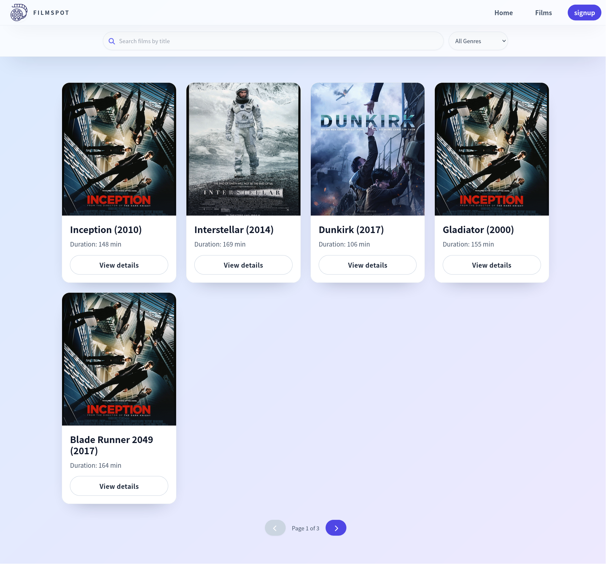

2. **Upcoming Screenings**
   - Explore upcoming screenings.
   - 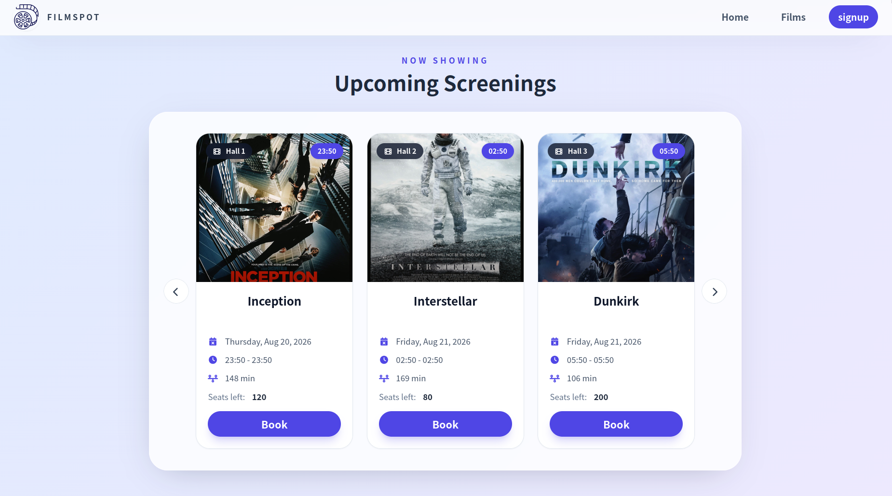

3. **Rate Movies**
   - Provide ratings for movies.
   - 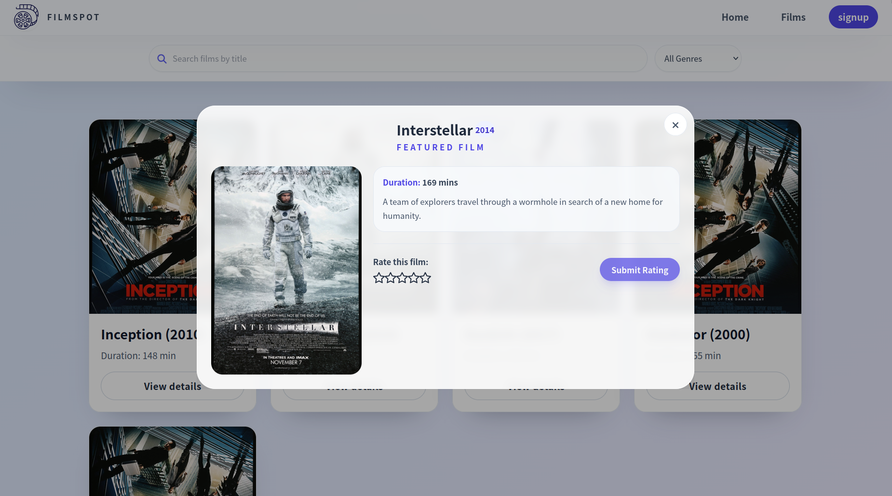

4. **User Authentication**
   - **Login:** Access your account securely.
     - 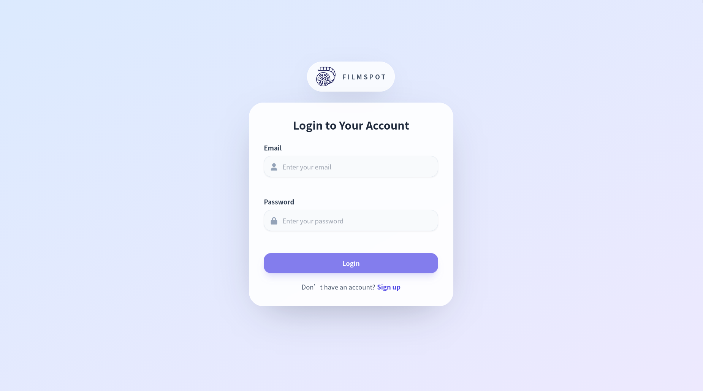
     - 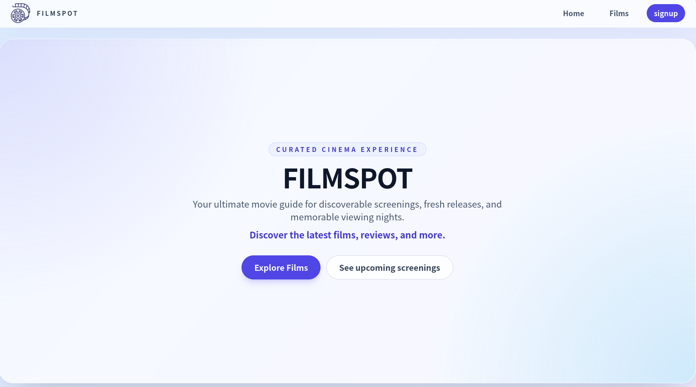
   - **Signup:** Create a new account easily.
     - 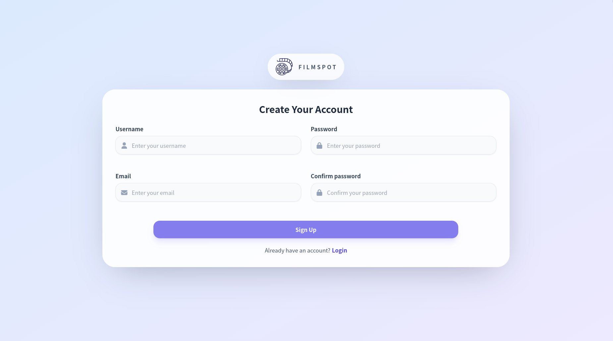

5. **Mobile Experience**
   - Fully responsive design for mobile devices.
   - 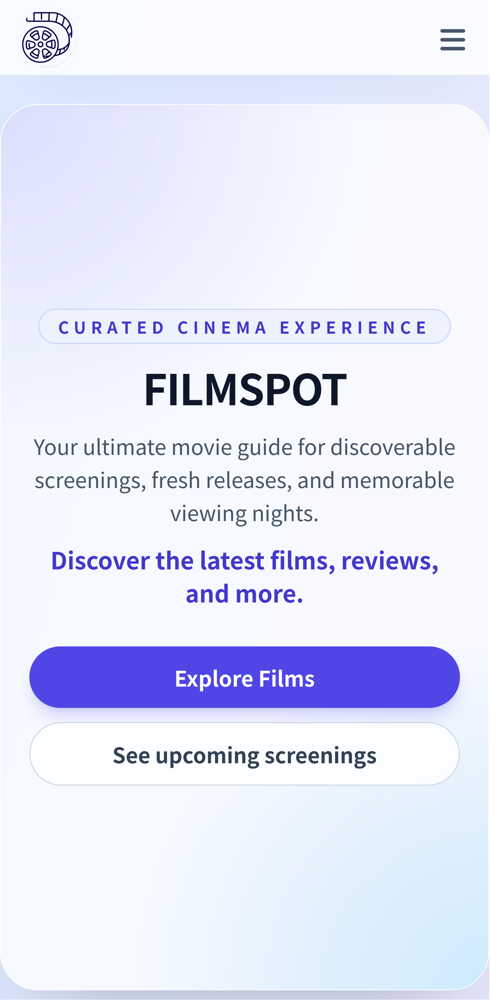
   - 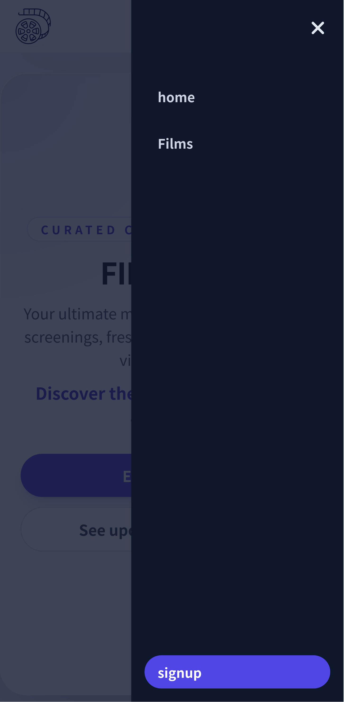

### Technologies

- **Angular**
- **TypeScript**
- **Tailwind CSS**
- **ngrx/signals**
- **PrimeNG**

---

## Backend: Films Spring Boot

This is a Spring Boot-based backend application that supports two main areas: **Customer** and **Admin**. It provides a RESTful API for an Angular frontend application and an admin management interface.

### Features

#### Admin Area

The admin area is built using **Thymeleaf templates**, **HTMX**, and **Tailwind CSS**. It provides an intuitive interface for managing the application's data.

1. **Dashboard**  
   A central hub for administrators to view key metrics and manage the system.  
   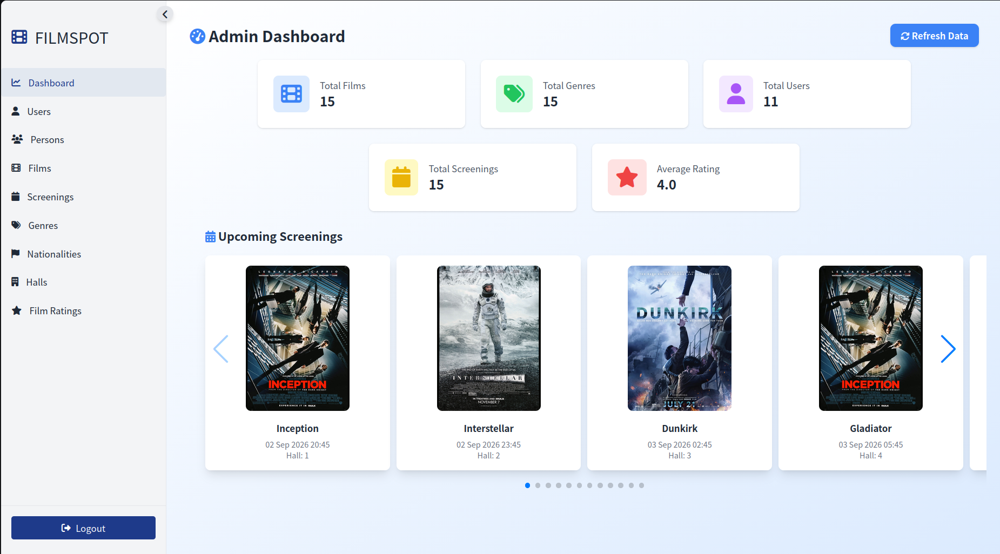

2. **Manage Screenings**
    - List all screenings in the system.  
      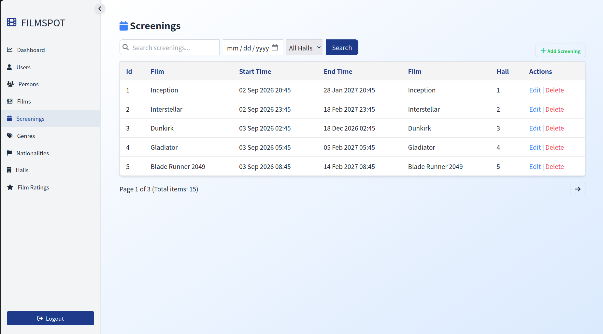
    - Edit screening details.  
      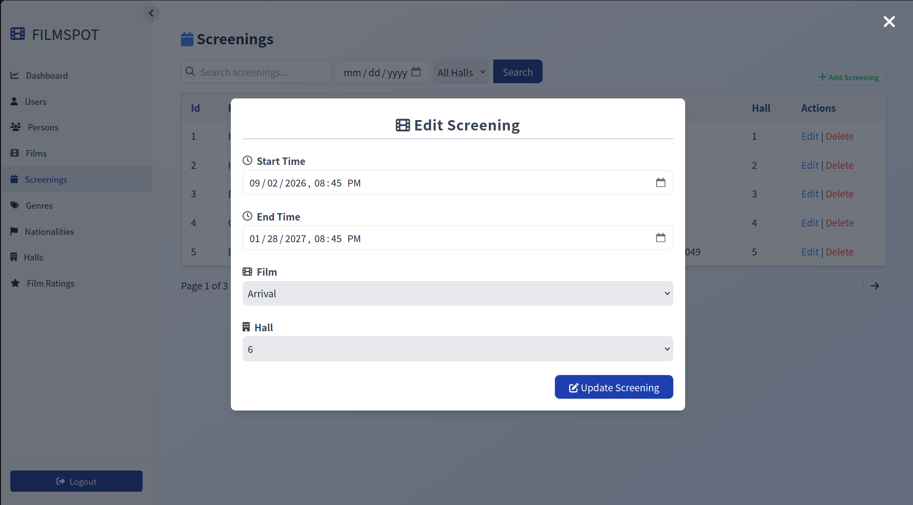

3. **Manage Users**
    - View and manage user accounts.  
      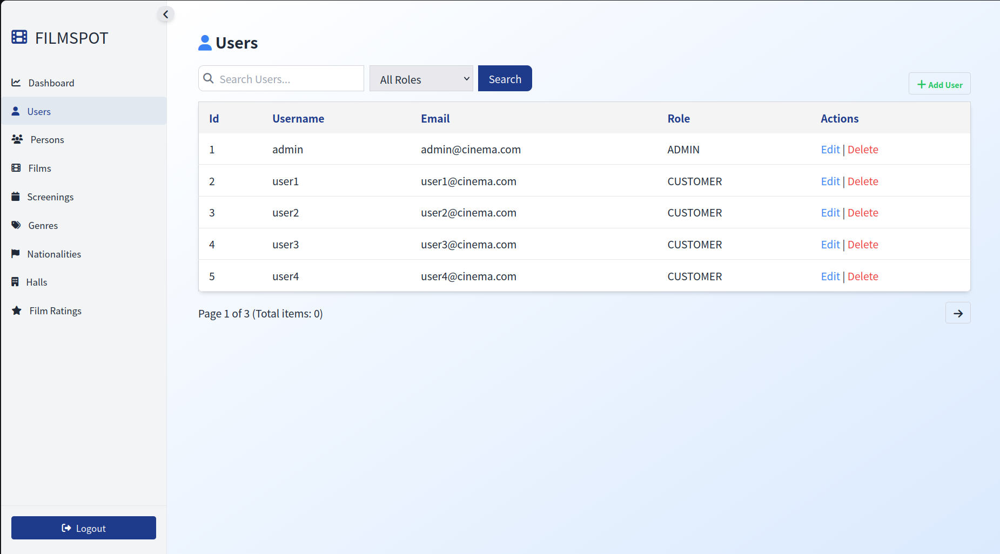

4. **Authentication**
    - Secure login for administrators.  
      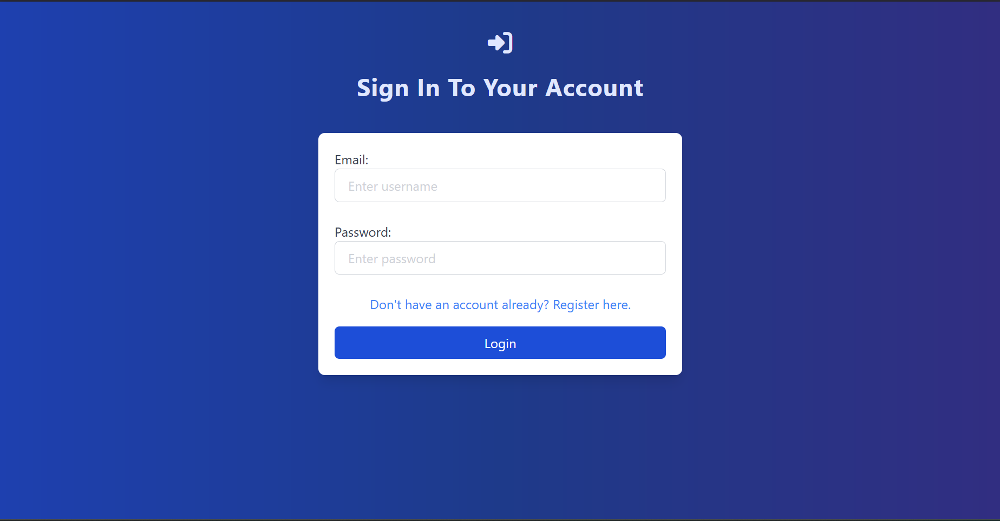

5. **View Movie Covers**
    - Preview movie covers directly in the admin interface.  
      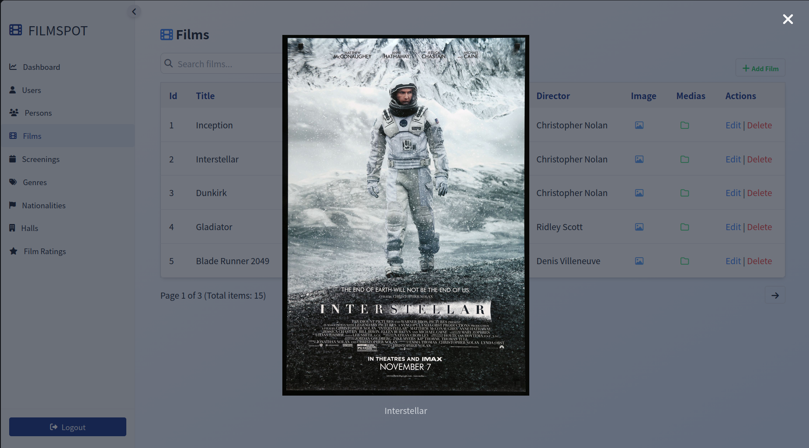

#### API for Customer Frontend

The backend provides a RESTful API consumed by the Angular frontend application, allowing customers to:

- View available movies and upcoming screenings
- Rate movies
- Manage their profiles

### Technologies

- **Spring Boot**: Backend framework
- **Thymeleaf**: Server-side rendering for the admin area
- **HTMX**: Dynamic, interactive web pages
- **Tailwind CSS**: Admin interface styling
- **Spring Data JPA**: Database interactions
- **Spring Security**: Authentication and authorization
- **Springdoc OpenAPI**: API documentation

---

## Getting Started

### Prerequisites

- **Node.js** (for Angular frontend)
- **Java JDK** (for Spring Boot backend)
- **Maven** (for building Spring Boot)
- **Docker** (for containerized development)

### Development Environment

This project includes Docker Compose configuration for easy setup:

```bash
docker-compose -f docker-compose.dev.yml up
```

### Running the Projects

#### Angular Frontend

Navigate to `Films_Angular/` directory and follow instructions in [Films_Angular/README.md](Films_Angular/README.md)

#### Spring Boot Backend

Navigate to `Films_SpringBoot/` directory and follow instructions in [Films_SpringBoot/README.md](Films_SpringBoot/README.md)

---

## Project Tools

- **Taskfile.yml**: Automation tasks for the project
- **docker-compose.dev.yml**: Development environment configuration
- **cinema.gaphor**: UML model diagrams

---

## Documentation

- [Angular Frontend Documentation](Films_Angular/README.md)
- [Spring Boot Backend Documentation](Films_SpringBoot/README.md)

---

## License

All rights reserved.
